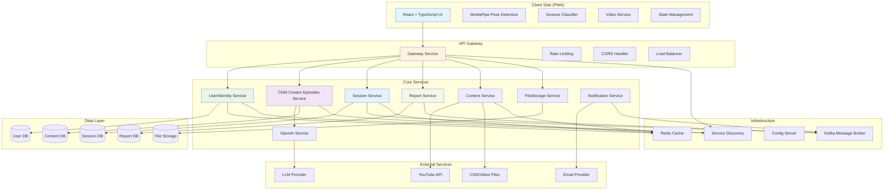
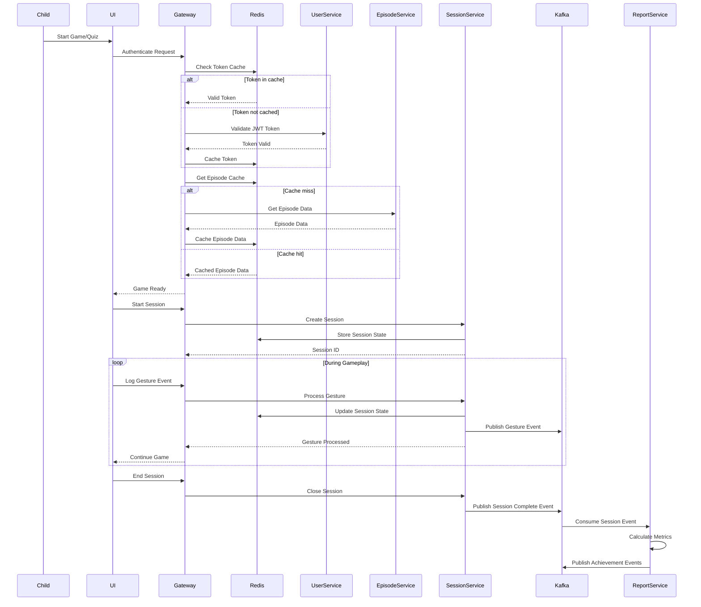

# Design Document

## Overview

The Interactive Video Quiz system is a Progressive Web Application (PWA) that combines video content consumption with gesture-based interaction and gamification. The system consists of a React-based frontend with real-time pose detection, a Spring Boot backend for content management and user data, and a MySQL database for persistent storage. The architecture prioritizes child safety through on-device processing, provides engaging user experiences through gesture recognition, and supports both educational quiz content and action-based games.

## Architecture

### High-Level Microservices Architecture



### Microservices Interaction Flow with Infrastructure



## Components and Interfaces

### Frontend Components

#### 1. Video Player Component
- **Purpose**: Manages video playback with checkpoint integration
- **Technologies**: YouTube iframe API, HTML5 video element
- **Key Features**:
  - Auto-pause at quiz checkpoints
  - Seamless resume after correct answers
  - Support for both YouTube and MP4 sources
  - Progress tracking and chapter navigation

#### 2. Pose Detection Engine
- **Technology**: @mediapipe/tasks-vision PoseLandmarker
- **Processing**: Client-side only (no data transmission)
- **Key Features**:
  - Real-time pose landmark detection
  - Multi-person detection with primary user focus
  - Lighting condition feedback
  - Performance optimization for mobile devices

#### 3. Gesture Classification System
- **Input**: Pose landmarks from MediaPipe
- **Output**: Classified gestures (jumping jack, squat, hands-on-head, wave, running, leaning)
- **Features**:
  - Custom classification algorithms
  - Smoothing and debounce logic
  - Confidence scoring
  - Seated mode alternative gestures

#### 4. Game Engine Components

##### Quiz Game Engine
- **Purpose**: Manages question-answer flow with gesture input
- **Features**:
  - Multiple choice question display
  - Gesture-to-answer mapping
  - Retry logic with encouraging feedback
  - Progress tracking

##### Action Game Engine
- **Purpose**: Translates gestures to game actions for subway surfer-style games
- **Features**:
  - Real-time gesture-to-movement translation
  - Obstacle detection and collision
  - Score calculation
  - Power-up activation via gestures

#### 5. UI Components
- **Design System**: High-contrast, child-friendly interface
- **Accessibility**: Screen reader support, keyboard navigation
- **Audio**: Immediate feedback for all interactions
- **Responsive**: Mobile-first PWA design

### Microservices

#### 1. API Gateway Service
- **Responsibilities**:
  - Request routing and load balancing
  - Rate limiting and throttling
  - CORS handling and security headers
  - Authentication token validation
  - Request/response logging and monitoring
- **Technology**: Spring Cloud Gateway or Zuul
- **Port**: 8080

#### 2. User/Identity Service
- **Responsibilities**:
  - Guardian authentication and authorization
  - JWT token generation and validation
  - Family account management
  - User profile management
  - GDPR compliance (data export/deletion)
- **Technology**: Spring Boot + Spring Security
- **Database**: MySQL (User DB)
- **Port**: 8081

#### 3. Child Creator Episodes Service
- **Responsibilities**:
  - Game episode creation and management
  - Quiz question generation via OpenAI integration
  - Checkpoint creation and timing
  - Content publishing and versioning
- **Technology**: Spring Boot
- **Database**: MySQL (Content DB)
- **Port**: 8082

#### 4. Session Service
- **Responsibilities**:
  - Real-time gameplay session management
  - WebSocket connections for live interaction
  - Gesture event processing and validation
  - Session state persistence and recovery
- **Technology**: Spring Boot + WebSocket
- **Database**: MySQL (Session DB)
- **Port**: 8083

#### 5. Report Service
- **Responsibilities**:
  - Mental engagement metrics calculation
  - Physical activity metrics processing
  - Weekly summary generation
  - PDF/CSV export functionality
  - Historical trend analysis
- **Technology**: Spring Boot + Apache PDFBox
- **Database**: MySQL (Report DB)
- **Port**: 8084

#### 6. Content Service
- **Responsibilities**:
  - Video metadata management
  - YouTube API integration
  - CDN routing for video playback
  - Content moderation and safety checks
- **Technology**: Spring Boot
- **Database**: MySQL (Content DB)
- **Port**: 8085

#### 7. FileStorage Service
- **Responsibilities**:
  - Image upload and storage (thumbnails, stickers)
  - File metadata management
  - Image processing and optimization
  - CDN integration for static assets
- **Technology**: Spring Boot + AWS S3/MinIO
- **Database**: File metadata in MySQL
- **Port**: 8086

#### 8. OpenAI Service
- **Responsibilities**:
  - Provider-agnostic LLM wrapper
  - Question generation from video content
  - Content analysis and moderation
  - Prompt management and optimization
- **Technology**: Spring Boot + OpenAI API
- **Port**: 8087

#### 9. Notification Service (Optional for MVP)
- **Responsibilities**:
  - Email notifications to parents
  - Achievement and progress alerts
  - System maintenance notifications
  - Template management
- **Technology**: Spring Boot + Email provider + Kafka Consumer
- **Port**: 8088

### Infrastructure Services

#### Message Broker (Apache Kafka)
- **Use Cases**:
  - **Gesture Events**: Real-time streaming from Session Service to Report Service
  - **User Activity**: Session completion events for notifications
  - **Achievement Triggers**: Score milestones for parent notifications
  - **System Events**: Service health monitoring and alerting
- **Topics**:
  - `gesture-events`: Real-time gesture data streaming
  - `session-events`: Session lifecycle events (start, pause, complete)
  - `user-achievements`: Achievement and milestone events
  - `system-notifications`: Service alerts and maintenance notifications

#### Caching Layer (Redis)
- **Use Cases**:
  - **Session State**: Active gameplay session data for quick access
  - **User Authentication**: JWT token blacklisting and session management
  - **Content Metadata**: Frequently accessed video metadata and episode data
  - **Rate Limiting**: API rate limiting counters per user/IP
  - **Leaderboards**: Real-time score rankings and achievements
- **Cache Patterns**:
  - **Write-Through**: User preferences and settings
  - **Cache-Aside**: Video metadata and episode specifications
  - **Write-Behind**: Non-critical analytics data

#### Service Discovery (Eureka/Consul)
- **Responsibilities**:
  - Service registration and health checking
  - Load balancing and failover
  - Configuration management
  - Service mesh coordination

#### Configuration Server (Spring Cloud Config)
- **Responsibilities**:
  - Centralized configuration management
  - Environment-specific settings
  - Feature flags and toggles
  - Secrets management integration

## Data Models

### Core Entities

```typescript
interface User {
  id: string;
  email: string;
  role: 'parent' | 'child';
  familyId: string;
  preferences: UserPreferences;
  createdAt: Date;
}

interface GameEpisode {
  id: string;
  title: string;
  videoUrl: string;
  videoType: 'youtube' | 'mp4';
  duration: number;
  checkpoints: Checkpoint[];
  gameType: 'quiz' | 'action';
  createdBy: string;
  isPublished: boolean;
}

interface Checkpoint {
  id: string;
  timestamp: number;
  question?: QuizQuestion;
  gameAction?: ActionGameEvent;
}

interface QuizQuestion {
  question: string;
  options: string[];
  correctAnswer: number;
  gestureMapping: GestureMapping[];
}

interface ActionGameEvent {
  eventType: 'obstacle' | 'powerup' | 'checkpoint';
  requiredGesture: GestureType;
  difficulty: number;
}

interface GameSession {
  id: string;
  userId: string;
  episodeId: string;
  startTime: Date;
  endTime?: Date;
  responses: GestureResponse[];
  metrics: SessionMetrics;
}

interface GestureResponse {
  checkpointId: string;
  gesture: GestureType;
  confidence: number;
  responseTime: number;
  isCorrect: boolean;
  attempts: number;
}

interface SessionMetrics {
  mentalScore: number;
  physicalActivity: PhysicalMetrics;
  gamePerformance?: GameMetrics;
}

interface PhysicalMetrics {
  totalGestures: number;
  gestureBreakdown: Record<GestureType, number>;
  formAccuracy: number;
  activeTime: number;
}

interface GameMetrics {
  finalScore: number;
  movementAccuracy: number;
  physicalIntensity: number;
}

type GestureType = 'jumping_jack' | 'squat' | 'hands_on_head' | 'wave' | 'run' | 'lean_left' | 'lean_right' | 'jump';
```

### Database Schema by Service

#### User/Identity Service Database
```sql
-- User DB Schema
CREATE TABLE families (
    id VARCHAR(36) PRIMARY KEY,
    name VARCHAR(255) NOT NULL,
    created_at TIMESTAMP DEFAULT CURRENT_TIMESTAMP
);

CREATE TABLE users (
    id VARCHAR(36) PRIMARY KEY,
    email VARCHAR(255) UNIQUE NOT NULL,
    password_hash VARCHAR(255) NOT NULL,
    role ENUM('parent', 'child') NOT NULL,
    family_id VARCHAR(36) NOT NULL,
    preferences JSON,
    created_at TIMESTAMP DEFAULT CURRENT_TIMESTAMP,
    FOREIGN KEY (family_id) REFERENCES families(id)
);

CREATE TABLE user_tokens (
    id VARCHAR(36) PRIMARY KEY,
    user_id VARCHAR(36) NOT NULL,
    token_hash VARCHAR(255) NOT NULL,
    expires_at TIMESTAMP NOT NULL,
    created_at TIMESTAMP DEFAULT CURRENT_TIMESTAMP,
    FOREIGN KEY (user_id) REFERENCES users(id)
);
```

#### Child Creator Episodes Service Database
```sql
-- Content DB Schema
CREATE TABLE game_episodes (
    id VARCHAR(36) PRIMARY KEY,
    title VARCHAR(255) NOT NULL,
    video_url TEXT NOT NULL,
    video_type ENUM('youtube', 'mp4') NOT NULL,
    duration INT NOT NULL,
    game_type ENUM('quiz', 'action') NOT NULL,
    episode_spec JSON NOT NULL,
    created_by VARCHAR(36) NOT NULL,
    is_published BOOLEAN DEFAULT FALSE,
    created_at TIMESTAMP DEFAULT CURRENT_TIMESTAMP,
    updated_at TIMESTAMP DEFAULT CURRENT_TIMESTAMP ON UPDATE CURRENT_TIMESTAMP
);

CREATE TABLE episode_checkpoints (
    id VARCHAR(36) PRIMARY KEY,
    episode_id VARCHAR(36) NOT NULL,
    timestamp_seconds INT NOT NULL,
    question_data JSON NOT NULL,
    created_at TIMESTAMP DEFAULT CURRENT_TIMESTAMP,
    FOREIGN KEY (episode_id) REFERENCES game_episodes(id)
);
```

#### Session Service Database
```sql
-- Session DB Schema
CREATE TABLE game_sessions (
    id VARCHAR(36) PRIMARY KEY,
    user_id VARCHAR(36) NOT NULL,
    episode_id VARCHAR(36) NOT NULL,
    start_time TIMESTAMP NOT NULL,
    end_time TIMESTAMP,
    session_data JSON NOT NULL,
    status ENUM('active', 'paused', 'completed', 'abandoned') DEFAULT 'active',
    created_at TIMESTAMP DEFAULT CURRENT_TIMESTAMP
);

CREATE TABLE gesture_events (
    id VARCHAR(36) PRIMARY KEY,
    session_id VARCHAR(36) NOT NULL,
    checkpoint_id VARCHAR(36) NOT NULL,
    gesture_type VARCHAR(50) NOT NULL,
    confidence DECIMAL(3,2) NOT NULL,
    response_time INT NOT NULL,
    is_correct BOOLEAN NOT NULL,
    attempt_number INT NOT NULL,
    timestamp TIMESTAMP DEFAULT CURRENT_TIMESTAMP,
    FOREIGN KEY (session_id) REFERENCES game_sessions(id)
);
```

#### Report Service Database
```sql
-- Report DB Schema
CREATE TABLE user_metrics (
    id VARCHAR(36) PRIMARY KEY,
    user_id VARCHAR(36) NOT NULL,
    session_id VARCHAR(36) NOT NULL,
    mental_score INT NOT NULL,
    physical_activity JSON NOT NULL,
    game_performance JSON,
    calculated_at TIMESTAMP DEFAULT CURRENT_TIMESTAMP
);

CREATE TABLE weekly_summaries (
    id VARCHAR(36) PRIMARY KEY,
    user_id VARCHAR(36) NOT NULL,
    week_start DATE NOT NULL,
    summary_data JSON NOT NULL,
    created_at TIMESTAMP DEFAULT CURRENT_TIMESTAMP
);
```

#### FileStorage Service Database
```sql
-- File metadata in Content DB
CREATE TABLE uploaded_files (
    id VARCHAR(36) PRIMARY KEY,
    filename VARCHAR(255) NOT NULL,
    file_type ENUM('thumbnail', 'sticker', 'avatar') NOT NULL,
    file_size BIGINT NOT NULL,
    mime_type VARCHAR(100) NOT NULL,
    storage_path TEXT NOT NULL,
    uploaded_by VARCHAR(36) NOT NULL,
    created_at TIMESTAMP DEFAULT CURRENT_TIMESTAMP
);
```

## Error Handling

### Client-Side Error Handling

#### Pose Detection Errors
- **Camera Access Denied**: Fallback to touch/click input with clear instructions
- **Poor Lighting**: Visual feedback with camera positioning guidance
- **No Person Detected**: Countdown timer with positioning help
- **Multiple People**: Focus indicator for primary user selection

#### Gesture Recognition Errors
- **Low Confidence**: Request gesture repeat with visual demonstration
- **Timeout**: Automatic skip option with encouragement
- **False Positives**: Debounce logic with confirmation prompts

#### Network Errors
- **Offline Mode**: PWA caching for previously loaded content
- **Slow Connection**: Progressive loading with activity indicators
- **API Failures**: Graceful degradation with local storage fallback

### Backend Error Handling

#### Content Processing Errors
- **Invalid Video URL**: Validation with helpful error messages
- **Content Moderation Failures**: Manual review queue with parent notification
- **Question Generation Errors**: Fallback to template-based questions

#### Data Persistence Errors
- **Database Connection**: Retry logic with exponential backoff
- **Data Validation**: Comprehensive input sanitization
- **Storage Limits**: Automatic archiving with user notification

## Testing Strategy

### Frontend Testing

#### Unit Tests
- Gesture classification accuracy testing
- UI component behavior validation
- State management logic verification
- Video player integration testing

#### Integration Tests
- MediaPipe pose detection pipeline
- Gesture-to-game-action mapping
- Real-time session synchronization
- PWA offline functionality

#### End-to-End Tests
- Complete quiz gameplay flow
- Action game interaction sequences
- Parent content creation workflow
- Report generation and export

### Microservices Testing Strategy

#### Service-Level Unit Tests
- **User/Identity Service**: JWT generation, authentication logic, family management
- **Child Creator Episodes**: Episode creation, checkpoint generation, content validation
- **Session Service**: WebSocket handling, gesture event processing, session state management
- **Report Service**: Metrics calculation, report generation, data aggregation
- **Content Service**: Video metadata extraction, YouTube API integration
- **FileStorage Service**: File upload, image processing, storage operations
- **OpenAI Service**: LLM integration, prompt management, response processing

#### Integration Tests
- **Service-to-Service Communication**: API contracts between microservices
- **Database Operations**: Each service's database interactions and transactions
- **External API Integration**: YouTube API, OpenAI API, email providers
- **Gateway Routing**: Request routing and authentication flow

#### End-to-End Tests
- **Complete User Flows**: Registration → Episode Creation → Gameplay → Reporting
- **Cross-Service Scenarios**: Session creation involving multiple services
- **Error Handling**: Service failure scenarios and circuit breaker patterns

#### Performance Tests
- **Individual Service Load**: Each microservice under concurrent load
- **Inter-Service Communication**: Network latency and throughput
- **Database Performance**: Query optimization per service database
- **Gateway Performance**: Request routing and rate limiting efficiency

### Accessibility Testing
- Screen reader compatibility
- Keyboard navigation flow
- High contrast mode validation
- Motor accessibility for gesture alternatives

### Security Testing
- JWT token validation
- Input sanitization verification
- Privacy compliance validation
- On-device processing verification