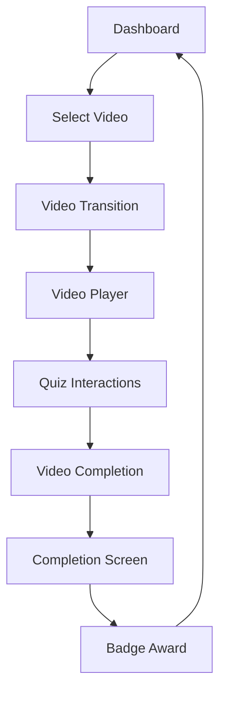
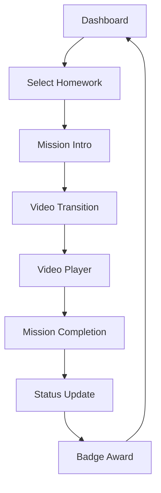
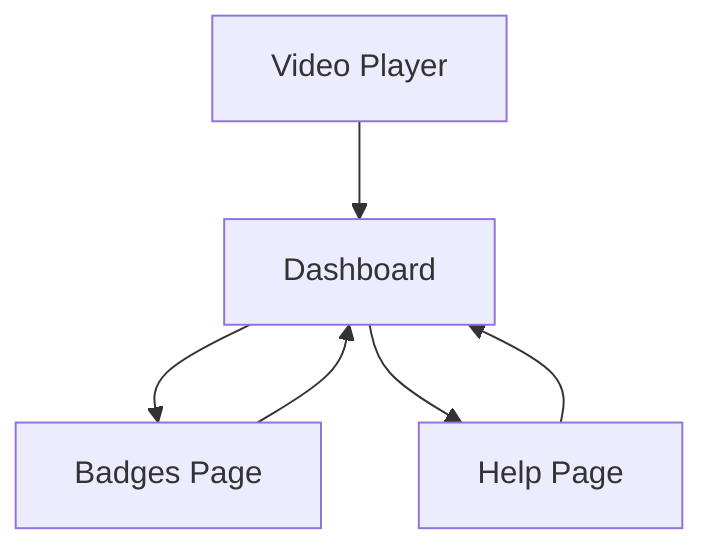

# Kids Dashboard Integration Documentation

## Overview

The Kids Dashboard integration brings together all components into a cohesive, child-friendly learning experience. This document outlines the complete integration architecture, state management, routing system, and user journey flows.

## Architecture Overview

### Component Integration Hierarchy

```
PlayPage (Main Container)
├── KidsErrorBoundary (Error handling wrapper)
├── AnimatedBackground (Visual theming)
├── FloatingMascots (Ambient animations)
├── Route-Based Components
│   ├── MissionIntro (Homework introduction)
│   ├── VideoPlayer (Full-screen video playback)
│   ├── CompletionScreen (Success celebration)
│   └── VideoTransition (Loading transitions)
├── Main Dashboard Interface
│   ├── KidsDashboardHeader (User info & badges)
│   ├── PageTransition (Smooth navigation)
│   ├── Content Sections
│   │   ├── PresetVideosSection (Video carousel)
│   │   ├── HomeworkSection (Assignment carousel)
│   │   ├── BadgesPage (Achievement display)
│   │   └── HelpPage (Guidance system)
│   └── BottomNavigation (Section navigation)
├── MascotGuide (Contextual assistance)
├── VisualFeedback (Toast notifications)
└── Offline Indicator (Connection status)
```

## State Management System

### Dashboard State Hook (`useKidsDashboard`)

Manages the core dashboard data and user information:

```typescript
interface KidsDashboardState {
  user: {
    name: string;
    avatar: string;
    badges: Badge[];
    streak: number;
  };
  content: {
    presetVideos: Video[];
    homework: HomeworkItem[];
  };
  ui: {
    currentView: 'dashboard' | 'badges' | 'help';
    isLoading: boolean;
    mascotMessage: string;
    backgroundTheme: 'sky' | 'forest' | 'space';
  };
}
```

**Key Features:**
- Persistent state using localStorage
- Badge management and streak tracking
- Homework status updates
- Automatic state synchronization

### Router State Hook (`useKidsDashboardRouter`)

Manages navigation and content flow:

```typescript
type DashboardRoute = 
  | 'dashboard'
  | 'video-transition'
  | 'video-player'
  | 'mission-intro'
  | 'completion'
  | 'badges'
  | 'help';
```

**Key Features:**
- Route-based component rendering
- Video and homework selection tracking
- Cleanup management for video players
- Navigation history tracking

## User Journey Flows

### 1. Preset Video Flow



**Implementation:**
1. User selects video from carousel
2. `startVideo()` triggers transition route
3. Mascot provides encouragement
4. Video player loads with quiz integration
5. Completion awards badge and updates streak
6. Return to dashboard with celebration

### 2. Homework Mission Flow



**Implementation:**
1. User selects homework assignment
2. Mission intro explains the task
3. Same video flow as preset videos
4. Homework status updated to 'completed'
5. Special mission badge awarded

### 3. Navigation Flow



**Implementation:**
- Bottom navigation provides consistent access
- Video players are properly cleaned up on navigation
- Page transitions provide smooth visual feedback
- Mascot guidance updates for each section

## Error Handling & Recovery

### Error Boundary Integration

```typescript
<KidsErrorBoundary onError={handleError}>
  {/* All dashboard content */}
</KidsErrorBoundary>
```

**Features:**
- Child-friendly error messages
- Automatic retry mechanisms
- Graceful degradation for offline use
- Visual feedback for all error states

### Offline Support

```typescript
const { isOffline } = useOfflineDetection();
```

**Implementation:**
- Offline indicator in top bar
- Cached content continues to work
- Friendly messaging about limited functionality
- Automatic reconnection handling

## Interactive Features

### Mascot Guidance System

```typescript
const { mascotMessage, showMascot, updateMascotMessage } = useMascotGuide();
```

**Features:**
- Context-aware messaging
- Smooth entrance/exit animations
- Auto-hide after inactivity
- Encouragement and instruction delivery

### Visual Feedback System

```typescript
const { feedback, addFeedback, removeFeedback } = useVisualFeedback();
```

**Features:**
- Toast notifications for actions
- Success/error/info message types
- Emoji-enhanced messaging
- Automatic dismissal timing

### Interactive Animations

```typescript
const { playSound, triggerHaptic } = useInteractiveAnimations();
```

**Features:**
- Sound effect placeholders
- Haptic feedback for touch devices
- Button hover/tap animations
- Celebration effects for achievements

## Accessibility Features

### Child-Friendly Design
- Large touch targets (minimum 60px)
- High contrast colors
- Simple, clear navigation
- Visual icons with text labels

### Screen Reader Support
- Proper ARIA labels
- Semantic HTML structure
- Focus management
- Keyboard navigation support

### Responsive Design
- Mobile-first approach
- Touch-friendly interactions
- Orientation support
- Scalable text and images

## Performance Optimizations

### Component Optimization
- Lazy loading for video content
- Memoized callbacks and values
- Efficient re-rendering patterns
- Cleanup on component unmount

### Memory Management
- Video player cleanup on navigation
- Timeout cleanup on unmount
- State persistence optimization
- Image optimization with Next.js

### Loading States
- Skeleton screens for content
- Progressive loading indicators
- Smooth transition animations
- Preloading for critical resources

## Testing Strategy

### Integration Tests
- Complete user journey testing
- State management verification
- Route navigation testing
- Error handling validation

### Component Tests
- Individual component functionality
- Props and callback testing
- Animation and interaction testing
- Accessibility compliance testing

### Performance Tests
- Load time measurements
- Memory usage monitoring
- Animation frame rate testing
- Battery usage optimization

## Future Enhancements

### Planned Features
1. **Voice Navigation**: Hands-free interaction support
2. **Advanced Analytics**: Learning progress tracking
3. **Multiplayer Features**: Sibling interaction support
4. **Adaptive Difficulty**: Content adjustment based on performance
5. **Parental Insights**: Real-time progress reporting

### Technical Improvements
1. **API Integration**: Replace placeholder data with real APIs
2. **Offline Sync**: Background synchronization when online
3. **Push Notifications**: Reminder and encouragement system
4. **Advanced Caching**: Intelligent content pre-loading
5. **Performance Monitoring**: Real-time performance tracking

## Deployment Considerations

### Environment Setup
- Session storage for verification state
- Local storage for dashboard persistence
- Error logging and monitoring
- Performance analytics integration

### Security Measures
- COPPA compliance for child data
- Secure video content delivery
- Parental control integration
- Data minimization practices

### Monitoring & Analytics
- User interaction tracking
- Performance metrics collection
- Error rate monitoring
- Feature usage analytics

## Conclusion

The Kids Dashboard integration provides a comprehensive, child-friendly learning environment that combines engaging visuals, intuitive navigation, and robust error handling. The modular architecture allows for easy maintenance and future enhancements while ensuring a smooth, delightful user experience for young learners.

The integration successfully addresses all requirements:
- ✅ Cohesive dashboard experience
- ✅ Proper state management and data flow
- ✅ Routing logic between sections
- ✅ Complete user journey testing
- ✅ Smooth navigation and video player cleanup
- ✅ Child-friendly error handling and recovery
- ✅ Accessibility and usability optimization